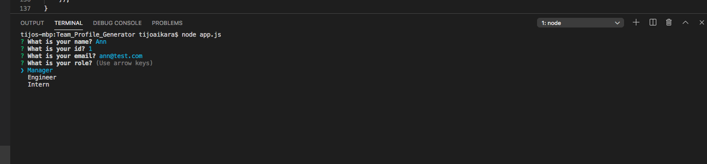
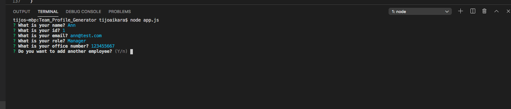
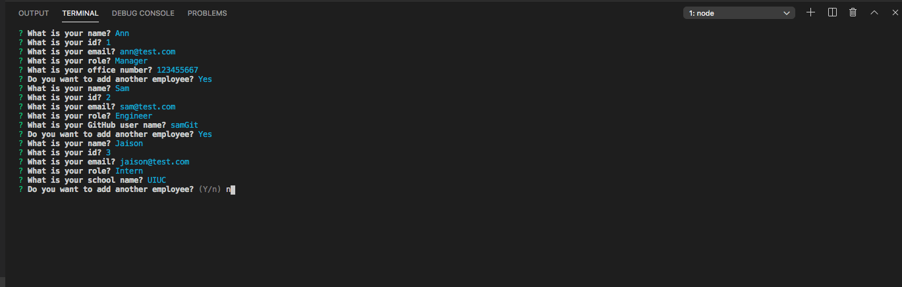
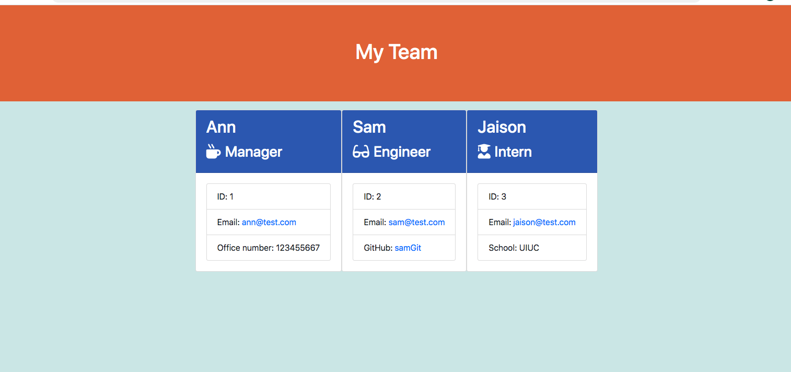

# Team_Profile_Generator

## Description
This project is a Node CLI, that takes in information about employees and generates an HTML webpage that displays summaries for each person. This is a team generator command line application. The application will prompt the user for information about the team manager and then information about the team members. The user can input any number of team members, and they may be a mix of engineers and interns.When the user has completed building the team, the application will create an HTML file that displays a nicely formatted team roster based on the information provided by the user.

## Table of Contents
* [Installation](#installation)
* [Usage](#usage)

## Installation
* require Node.js

## Usage
* Please find the below screenshots which shows the working of the application

